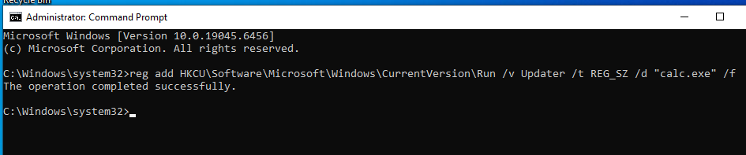
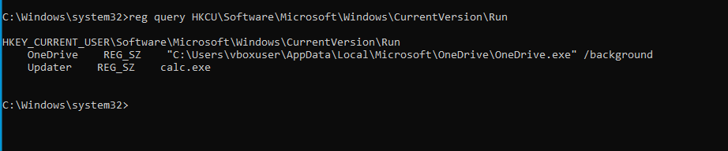
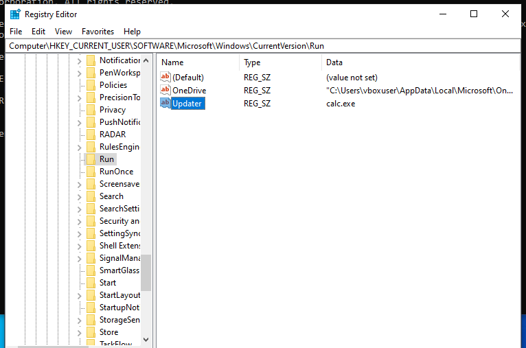

# 🛡️ Blue Team Lab: Detecting Persistence via Scheduled Tasks

## 🎯 Objective
Learn how attackers maintain access to a system using Scheduled Tasks, and how to detect this activity as a Blue Team analyst.

---

## 🧠 What is Persistence? (Simple Explanation)
Persistence is when an attacker ensures they can stay on a system even after initial access.

One common method:
Creating a Scheduled Task that runs malicious code repeatedly.

---

## 💻 Lab Setup
- Windows 10 VM  
- Command Prompt (Administrator)  
- Event Viewer  

---

## 🧪 Step 1 — Simulate Attacker Behaviour

Run:

    schtasks /create /tn "Updater" /tr "cmd.exe /c calc.exe" /sc minute /mo 1

### What this does:
- Creates a scheduled task called Updater  
- Runs every 1 minute  
- Executes a command using cmd.exe  

In a real attack, this could be malware instead of calc.exe.

---

## 🔎 Step 2 — Quickly Find the Task

Run:

    schtasks /query /fo LIST | findstr Updater

### Example Output:

    TaskName: Updater
    TaskName: \Microsoft\Windows\Application Experience\ProgramDataUpdater
    TaskName: \Microsoft\Windows\DirectX\DirectXDatabaseUpdater

### Key Insight:
- Updater → Suspicious (created during lab)  
- Other tasks → Legitimate Windows tasks  

---

## 🔍 Step 3 — Investigate the Task in Detail

Run:

    schtasks /query /tn Updater /fo LIST /v

### Look for:
- Task To Run  
- Schedule  
- Author  
- Run As User  

---

## 🚨 Step 4 — Why This is Suspicious

- Runs every minute  
- Uses cmd.exe  
- Generic name "Updater"  
- No clear purpose  

---

## 🔎 Step 5 — Check in Task Scheduler GUI

Press Win + R and type:

    taskschd.msc

Go to:
Task Scheduler Library

Find:
Updater

---

## ⚠️ Step 6 — Enable Logging

Go to:

Event Viewer → Applications and Services Logs → Microsoft → Windows → TaskScheduler → Operational

Click:
Enable Log

---

## 🔁 Step 7 — Trigger a New Event

Run:

    schtasks /create /tn "Updater2" /tr "cmd.exe /c calc.exe" /sc minute /mo 1

---

## 🔍 Step 8 — Detect Task Creation Event

In Event Viewer:

Go to:
TaskScheduler → Operational

Filter:
Event ID 106

---

## 🧠 Analyst Explanation

A scheduled task named "Updater" was identified running every minute and executing cmd.exe, which is unusual behaviour and may indicate persistence.

Task Scheduler logging was initially disabled and had to be enabled to capture Event ID 106, reflecting real-world environments where logging is not always active.

---

## 🚀 Key Takeaways

- Scheduled Tasks can be used for persistence  
- Filtering is faster than manual searching  
- Not all tasks are malicious  
- Logging may need to be enabled  
- Analysis is more important than just commands  

---

## 🔥 Why This Matters

This lab shows:
- Understanding of attacker persistence techniques  
- Ability to detect suspicious behaviour  
- Real-world Blue Team skills

# 🛡️ Blue Team Lab: Detecting Registry Persistence (Startup Programs)

## 🎯 Objective
Learn how attackers maintain access using Windows Registry startup keys, and how to detect this persistence technique as a Blue Team analyst.

---

## 🧠 What is Registry Persistence? (Simple Explanation)
Registry persistence is when an attacker adds a program to run automatically every time a user logs into Windows.

Instead of using scheduled tasks, attackers store their program in:
- Windows startup registry keys

This makes the program execute silently in the background at login.

---

## 💻 Lab Setup
- Windows 10 VM  
- Command Prompt (Administrator)  
- Registry Editor (regedit)  

---

## 🧪 Step 1 — Simulate Attacker Behaviour

Run:

    reg add HKCU\Software\Microsoft\Windows\CurrentVersion\Run /v Updater /t REG_SZ /d "calc.exe" /f

### What this does:
- Creates a registry entry called "Updater"
- Stores it in a startup location
- Executes calc.exe every time the user logs in

In a real attack, this would likely be malware instead of calc.exe.

---

## 🔎 Step 2 — Verify the Registry Entry

Run:

    reg query HKCU\Software\Microsoft\Windows\CurrentVersion\Run

### Example Output:

    Updater    REG_SZ    calc.exe

---

## 🔍 Step 3 — Detect Using Registry Editor (GUI)

1. Press Win + R  
2. Type:

    regedit

3. Navigate to:

    HKEY_CURRENT_USER
    → Software
    → Microsoft
    → Windows
    → CurrentVersion
    → Run

Look for:
Updater

---

## 🚨 Step 4 — Why This is Suspicious

Indicators of compromise:

- Runs automatically at login  
- Generic name "Updater"  
- Executes a program via registry  
- No clear or legitimate purpose  

---

## 🧠 Analyst Explanation

A registry entry named "Updater" was identified in the Windows startup key, configured to execute calc.exe upon user login. This behaviour is suspicious, as attackers commonly use registry run keys to establish persistence and maintain access to a system after compromise.

---

## 🚀 Key Takeaways

- Attackers use registry keys for persistence  
- Startup programs can execute automatically at login  
- Registry-based persistence is harder to detect than scheduled tasks  
- Analysts must check common persistence locations manually  
- Context is key when identifying suspicious entries  

---

## 🔥 Why This Matters

This lab demonstrates:
- Understanding of registry-based persistence techniques  
- Ability to detect hidden startup entries  
- Real-world Blue Team investigation skills  

