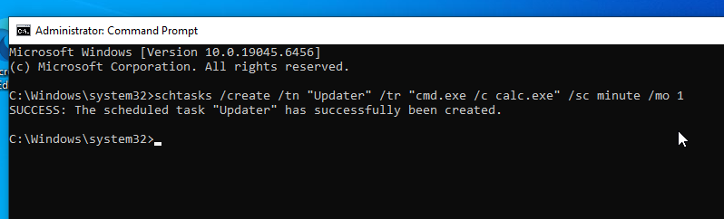
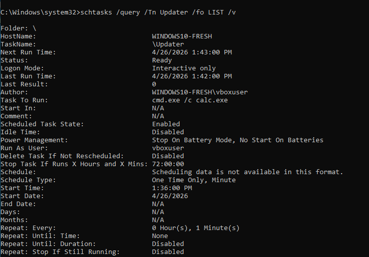
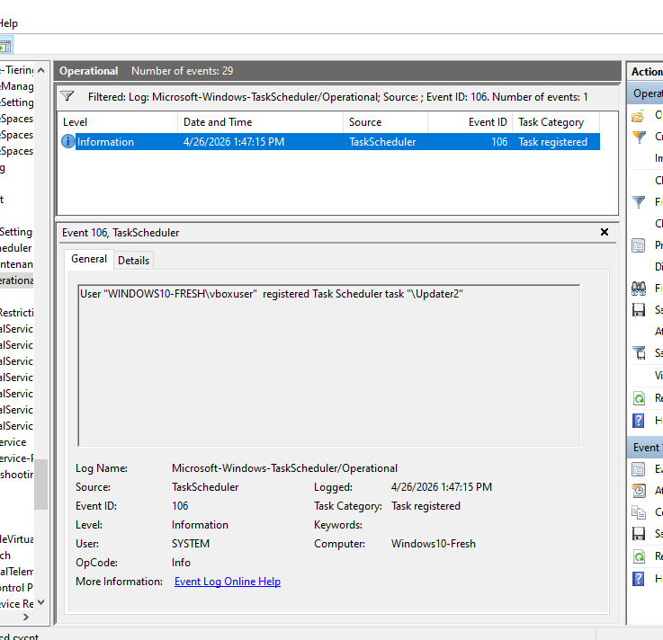
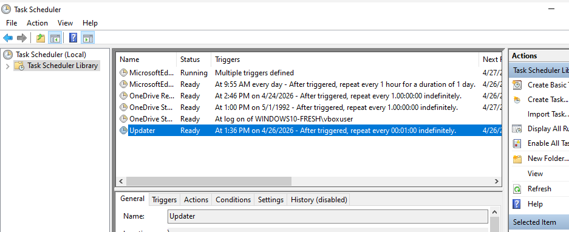

# 🛡️ Blue Team Lab: Detecting Persistence via Scheduled Tasks

## 🎯 Objective
Learn how attackers maintain access to a system using Scheduled Tasks, and how to detect this activity as a Blue Team analyst.

---

## 🧠 What is Persistence? (Simple Explanation)
Persistence is when an attacker ensures they can stay on a system even after initial access.

One common method:
Creating a Scheduled Task that runs malicious code repeatedly.

---

## 💻 Lab Setup
- Windows 10 VM  
- Command Prompt (Administrator)  
- Event Viewer  

---

## 🧪 Step 1 — Simulate Attacker Behaviour

Run:

    schtasks /create /tn "Updater" /tr "cmd.exe /c calc.exe" /sc minute /mo 1

### What this does:
- Creates a scheduled task called Updater  
- Runs every 1 minute  
- Executes a command using cmd.exe  

In a real attack, this could be malware instead of calc.exe.

---

## 🔎 Step 2 — Quickly Find the Task

Run:

    schtasks /query /fo LIST | findstr Updater

### Example Output:

    TaskName: Updater
    TaskName: \Microsoft\Windows\Application Experience\ProgramDataUpdater
    TaskName: \Microsoft\Windows\DirectX\DirectXDatabaseUpdater

### Key Insight:
- Updater → Suspicious (created during lab)  
- Other tasks → Legitimate Windows tasks  

---

## 🔍 Step 3 — Investigate the Task in Detail

Run:

    schtasks /query /tn Updater /fo LIST /v

### Look for:
- Task To Run  
- Schedule  
- Author  
- Run As User  

---

## 🚨 Step 4 — Why This is Suspicious

- Runs every minute  
- Uses cmd.exe  
- Generic name "Updater"  
- No clear purpose  

---

## 🔎 Step 5 — Check in Task Scheduler GUI

Press Win + R and type:

    taskschd.msc

Go to:
Task Scheduler Library

Find:
Updater

---

## ⚠️ Step 6 — Enable Logging

Go to:

Event Viewer → Applications and Services Logs → Microsoft → Windows → TaskScheduler → Operational

Click:
Enable Log

---

## 🔁 Step 7 — Trigger a New Event

Run:

    schtasks /create /tn "Updater2" /tr "cmd.exe /c calc.exe" /sc minute /mo 1

---

## 🔍 Step 8 — Detect Task Creation Event

In Event Viewer:

Go to:
TaskScheduler → Operational

Filter:
Event ID 106

---

## 🧠 Analyst Explanation

A scheduled task named "Updater" was identified running every minute and executing cmd.exe, which is unusual behaviour and may indicate persistence.

Task Scheduler logging was initially disabled and had to be enabled to capture Event ID 106, reflecting real-world environments where logging is not always active.

---

## 🚀 Key Takeaways

- Scheduled Tasks can be used for persistence  
- Filtering is faster than manual searching  
- Not all tasks are malicious  
- Logging may need to be enabled  
- Analysis is more important than just commands  

---

## 🔥 Why This Matters

This lab shows:
- Understanding of attacker persistence techniques  
- Ability to detect suspicious behaviour  
- Real-world Blue Team skills  
